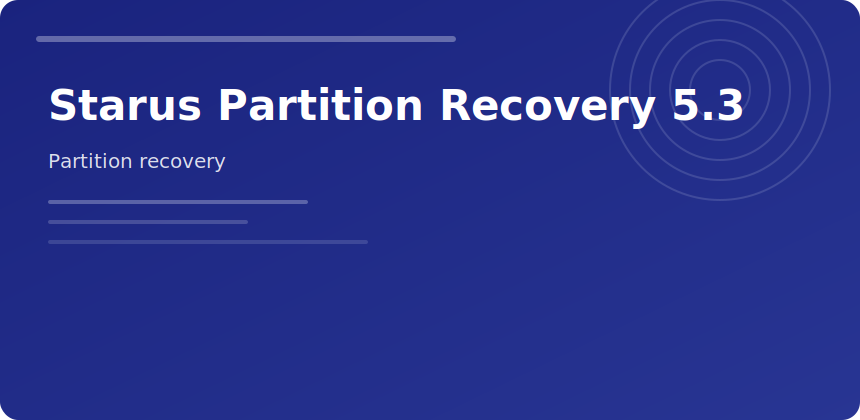

  

  

### Starus Partition Recovery 5.3

Focused on **lost partitions** after repartition, clone mistakes, or corrupted partition tables—not just deleted files.

#### Wizard flow

1. Select physical disk
2. Quick partition search
3. Full scan if quick misses extended/logical volumes
4. Mark found volumes → recover files or restore partition entry

#### Comparison

| Feature | Benefit |
|---------|---------|
| RAW recovery | When filesystem metadata gone |
| Preview | Avoid junk restores |
| Image support | Work on disk dumps |

v5.3 improves NTFS fast scan on large 4Kn drives.

starus partition recovery 5.3 formatted drive data restore
